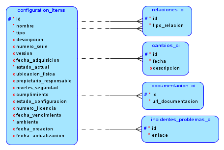
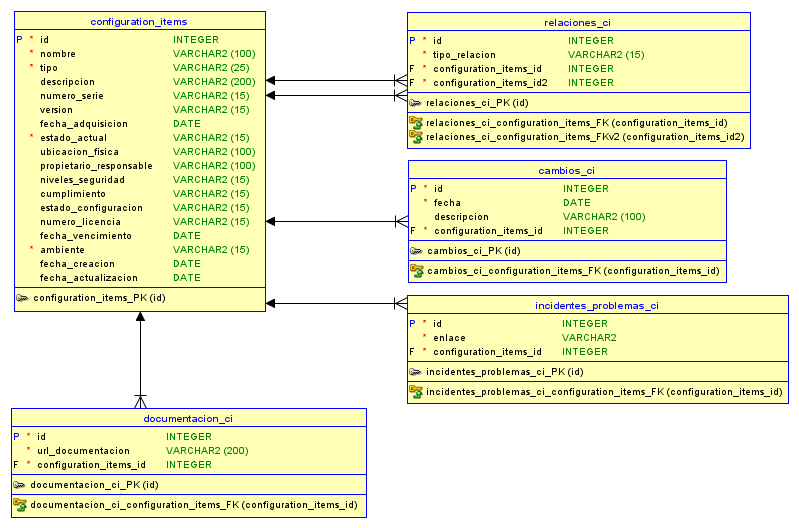
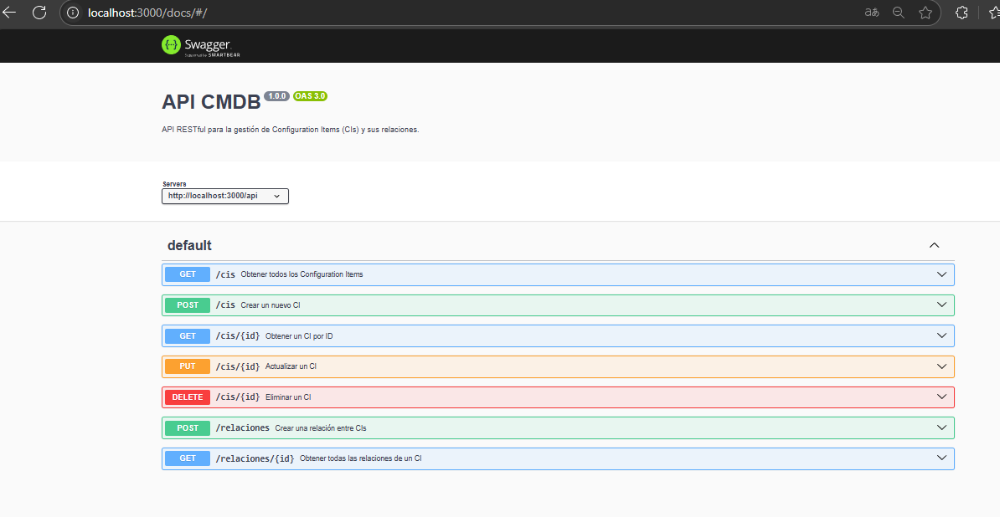
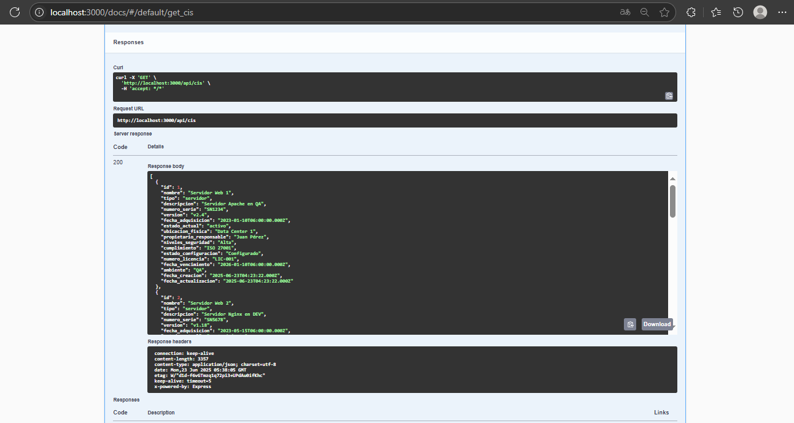
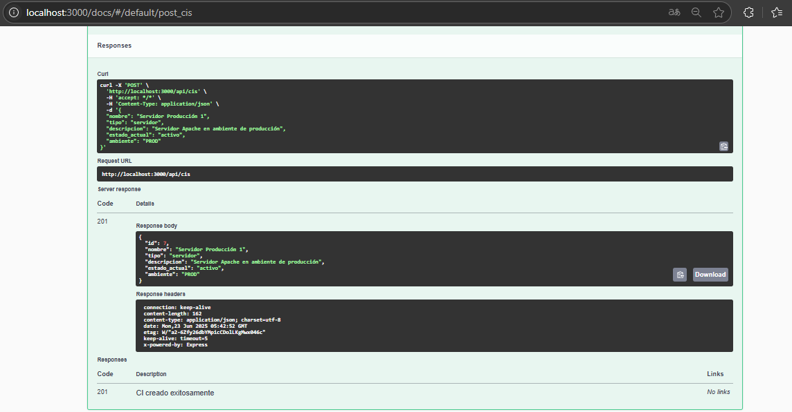

*Universidad de San Carlos de Guatemala*  
*Facultad de Ingenieria*  
*Escuela de Ciencias y Sistemas*  
*Software Avanzado*  
*Vacaciones del Primer Semestre 2025*  
___
**201908355 - Danny Hugo Bryan Tejaxún Pichiyá**  
___
## **Tarea 3**

## Modelos
### Modelo Lógico


### ER


## Script de Base de Datos
```sql
DROP DATABASE IF EXISTS sa_t3;
CREATE DATABASE IF NOT EXISTS sa_t3;

CREATE TABLE IF NOT EXISTS sa_t3.configuration_items (
    id INT PRIMARY KEY NOT NULL,
    nombre VARCHAR(100) NOT NULL,
    tipo VARCHAR(25) NOT NULL CHECK (tipo IN ('servidor', 'base de datos', 'aplicacion', 'otros')),
    descripcion VARCHAR(200),
    numero_serie VARCHAR(15),
    version VARCHAR(15),
    fecha_adquisicion DATE,
    estado_actual VARCHAR(15) NOT NULL CHECK (estado_actual IN ('activo', 'inactivo', 'mantenimiento', 'retirado')),
    ubicacion_fisica VARCHAR(100),
    propietario_responsable VARCHAR(100),
    niveles_seguridad VARCHAR(15),
    cumplimiento VARCHAR(15),
    estado_configuracion VARCHAR(15),
    numero_licencia VARCHAR(15),
    fecha_vencimiento DATE,
    ambiente VARCHAR(15) NOT NULL CHECK (ambiente IN ('DEV', 'QA', 'PROD')),
    fecha_creacion DATE,
    fecha_actualizacion DATE
);

CREATE TABLE IF NOT EXISTS sa_t3.cambios_ci (
    id INT PRIMARY KEY NOT NULL,
    fecha DATE NOT NULL,
    descripcion VARCHAR(100),
    ci_padre_id INT NOT NULL,
    ci_hijo_id INT NOT NULL,
    FOREIGN KEY (ci_padre_id) REFERENCES configuration_items(id) ON DELETE CASCADE,
    FOREIGN KEY (ci_hijo_id) REFERENCES configuration_items(id) ON DELETE CASCADE
);

CREATE TABLE IF NOT EXISTS sa_t3.documentacion_ci (
    id INT PRIMARY KEY NOT NULL,
    url_documentacion VARCHAR(200) NOT NULL,
    configuration_items_id INT NOT NULL,
    FOREIGN KEY (configuration_items_id) REFERENCES configuration_items(id) ON DELETE CASCADE
);

CREATE TABLE IF NOT EXISTS sa_t3.incidentes_problemas_ci (
    id INT PRIMARY KEY NOT NULL,
    enlace VARCHAR(255) NOT NULL,
    configuration_items_id INT NOT NULL,
    FOREIGN KEY (configuration_items_id) REFERENCES configuration_items(id) ON DELETE CASCADE
);

CREATE TABLE IF NOT EXISTS sa_t3.relaciones_ci (
    id INT PRIMARY KEY NOT NULL,
    tipo_relacion VARCHAR(15) NOT NULL,
    configuration_items_id INT NOT NULL,
    configuration_items_id2 INT NOT NULL,
    FOREIGN KEY (configuration_items_id) REFERENCES configuration_items(id) ON DELETE CASCADE,
    FOREIGN KEY (configuration_items_id2) REFERENCES configuration_items(id) ON DELETE CASCADE
);
```

## Seeds
```sql
INSERT INTO sa_t3.configuration_items (id, nombre, tipo, descripcion, numero_serie, version, fecha_adquisicion, estado_actual, ubicacion_fisica, propietario_responsable, niveles_seguridad, cumplimiento, estado_configuracion, numero_licencia, fecha_vencimiento, ambiente)
VALUES 
(1, 'Servidor Web 1', 'servidor', 'Servidor Apache en QA', 'SN1234', 'v2.4', '2023-01-10', 'activo', 'Data Center 1', 'Juan Pérez', 'Alta', 'ISO 27001', 'Configurado', 'LIC-001', '2026-01-10', 'QA'),
(2, 'Servidor Web 2', 'servidor', 'Servidor Nginx en DEV', 'SN5678', 'v1.18', '2023-05-15', 'mantenimiento', 'Data Center 2', 'María Gómez', 'Media', 'Ninguno', 'Configurado', 'LIC-002', '2025-05-15', 'DEV'),
(3, 'Base de Datos 1', 'base de datos', 'MySQL 8 para QA', 'SN3456', 'v8.0', '2023-02-20', 'activo', 'Data Center 1', 'Carlos López', 'Alta', 'ISO 27001', 'Configurado', 'LIC-003', '2026-02-20', 'QA'),
(4, 'Base de Datos 2', 'base de datos', 'Postgres para DEV', 'SN7890', 'v14', '2023-06-01', 'activo', 'Data Center 2', 'Ana Torres', 'Media', 'GDPR', 'Configurado', 'LIC-004', '2025-06-01', 'DEV'),
(5, 'Aplicación Web 1', 'aplicacion', 'Aplicación Node.js QA', 'SN9999', 'v1.0', '2023-03-12', 'activo', 'Oficina Central', 'Luis Morales', 'Alta', 'ISO 27001', 'En pruebas', 'LIC-005', '2025-03-12', 'QA'),
(6, 'Aplicación Web 2', 'aplicacion', 'Aplicación Express DEV', 'SN8888', 'v1.1', '2023-07-10', 'activo', 'Oficina Central', 'Pedro Martínez', 'Media', 'Ninguno', 'En desarrollo', 'LIC-006', '2024-07-10', 'DEV');

INSERT INTO sa_t3.relaciones_ci (id, ci_padre_id, ci_hijo_id, tipo_relacion) VALUES
(1, 1, 3, 'depende de'),
(2, 5, 1, 'se ejecuta en'),
(3, 2, 4, 'depende de'),
(4, 6, 2, 'se ejecuta en');

INSERT INTO sa_t3.cambios_ci (id, ci_id, fecha, descripcion) VALUES
(1, 1, '2024-01-01', 'Registro inicial del servidor.'),
(2, 2, '2024-01-01', 'Registro inicial del servidor.'),
(3, 3, '2024-01-01', 'Registro inicial de la base de datos.'),
(4, 4, '2024-01-01', 'Registro inicial de la base de datos.'),
(5, 5, '2024-01-01', 'Registro inicial de la aplicación web.'),
(6, 6, '2024-01-01', 'Registro inicial de la aplicación web.');

INSERT INTO sa_t3.documentacion_ci (id, ci_id, url_documentacion) VALUES
(1, 1, 'https://url_documentacion_ejemplo.com'),
(2, 2, 'https://url_documentacion_ejemplo.com'),
(3, 3, 'https://url_documentacion_ejemplo.com'),
(4, 4, 'https://url_documentacion_ejemplo.com'),
(5, 5, 'https://url_documentacion_ejemplo.com'),
(6, 6, 'https://url_documentacion_ejemplo.com');

INSERT INTO sa_t3.incidentes_problemas_ci (id, ci_id, enlace) VALUES
(1, 1, 'https://url_incidente_ejemplo.com'),
(2, 3, 'https://url_incidente_ejemplo.com'),
(3, 5, 'https://url_incidente_ejemplo.com'),
(4, 6, 'https://url_incidente_ejemplo.com');
```

## Documentación API





